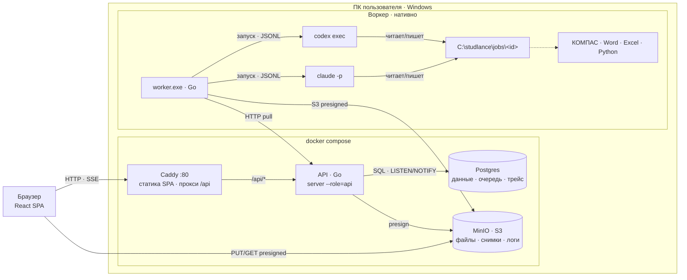
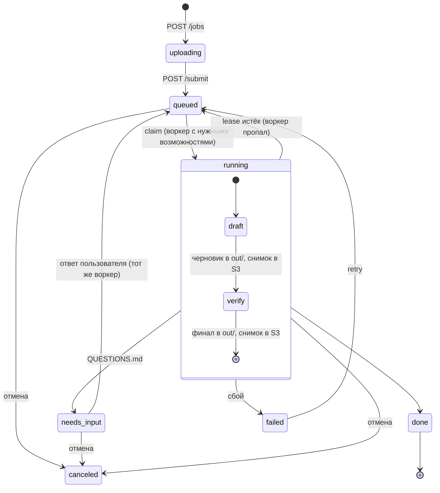
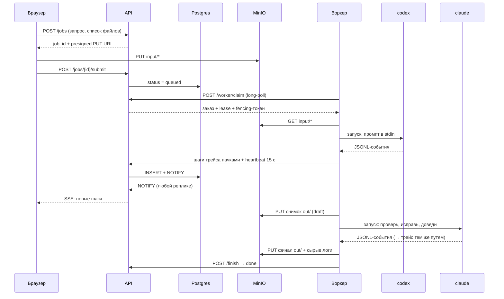

# Studlance — архитектура

Статус: **согласовано для MVP**. Документ фиксирует решения до начала разработки.
Всё, что здесь описано для MVP, — урезанная версия той же схемы, что пойдёт в прод: переход в прод меняет конфигурацию и развёртывание, а не код.

## 0. Что делаем

Сайт, куда загружается студенческая работа (задание, методичка, варианты и т. п.) и пишется текстовый запрос. Дальше всё автоматически:

1. **codex** делает **черновой** полный комплект работы (отчёт Word, расчёты Excel, чертежи КОМПАС, графики, схемы — что требует задание).
2. **claude** верифицирует всё и **сам исправляет** найденное, доводя работу до финала: ничего не выдумано, всё соответствует заданию и методичке, графики/чертежи/схемы корректны, оформление по требованиям.
3. Готовый комплект скачивается с сайта.

Агентов **не ограничиваем**: как работать, какие инструменты использовать, где смотреть ГОСТы — решают они сами. Мы фиксируем только вход, выход и критерии проверки.

Каждое действие агентов попадает в **трейс**, чтобы всегда можно было разобраться, почему результат получился именно таким.

## 1. Принятые решения

| # | Решение |
|---|---|
| D1 | Две плоскости: **control plane** (сайт, API, Postgres, S3) и **execution plane** (воркеры с codex/claude). |
| D2 | Воркер **сам забирает** работу (pull по HTTPS, только исходящие соединения). Работает за NAT, входящие порты не нужны. |
| D3 | Единица работы — **заказ целиком**, закреплённый за одним воркером (сессии CLI и рабочая папка живут локально). |
| D4 | Процесс: **codex (черновик, один проход) → claude (проверка + правки до финала)**. Возврата к codex нет. |
| D5 | Полностью автоматически. Единственная пауза — если агенту не хватает данных (`QUESTIONS.md`), пользователь отвечает на сайте. |
| D6 | Очередь — **таблица в Postgres** + `FOR UPDATE SKIP LOCKED`, leases, heartbeat, **fencing-токен**. Отдельного брокера нет. |
| D7 | Файлы — **S3 API** с первого дня (MinIO локально), передача по presigned URL мимо API. |
| D8 | Live-обновления — **SSE** + Postgres `LISTEN/NOTIFY`. Redis нет. |
| D9 | API **stateless**, без синглтонов. Модульный монолит: **один Go-бинарник с ролями** (`api`, позже `autoscaler`). Микросервисов нет. |
| D10 | Контракт API — **OpenAPI-first** (`api/openapi.yaml`): из него генерируются Go-сервер и TS-клиент. |
| D11 | Маршрутизация по **возможностям** воркера (`kompas`, `word`, `excel`, …) и требованиям заказа. |
| D12 | Трейс — свои таблицы (`agent_runs`, `trace_steps`) + **сырые JSONL-логи** агентов в S3. |
| D13 | `user_id` во всех пользовательских данных с первого дня. |
| D14 | MVP: сервер (docker compose) и воркер **на ПК пользователя**, агенты по подпискам. Прод: пул Windows-VM, агенты по API-ключам. |
| D15 | Стек: **Go** (API + воркер), **React + Vite + TypeScript** (фронт), PostgreSQL, MinIO/S3, Caddy. |

## 2. Топология MVP



Воркер ходит в API по HTTP так же, как будет ходить с удалённой VM. Перенос сервера на VPS — смена `server_url` в конфиге воркера.

## 3. Жизненный цикл заказа



- `status`: `uploading | queued | running | needs_input | done | failed | canceled`.
- `stage` (внутри `running`): `draft` (codex) | `verify` (claude).
- `done` с непустым списком нерешённых замечаний claude помечается флагом `needs_attention` — в UI это видно сразу.

## 4. Контракт с агентами

### Рабочая папка

```
C:\studlance\jobs\<job_id>\
├─ input\             файлы пользователя (как загружены, с относительными путями)
├─ TASK.md            запрос пользователя + перечень прикреплённых файлов
├─ out\               готовый комплект: .docx .xlsx .cdw/.frw .pdf .png …
├─ SUMMARY.md         codex: что сделано, из чего состоит комплект
├─ QUESTIONS.md       (если появился) чего не хватает → пауза заказа
├─ VERIFICATION.md    claude: что проверил, что нашёл, что исправил
├─ verification.json  claude: машиночитаемый итог для UI
└─ .studlance\        служебное воркера (не трогать агентам)
```

`verification.json`:

```json
{
  "found": 7,
  "fixed": 7,
  "remaining": [
    { "severity": "major|minor", "description": "…" }
  ]
}
```

### Что говорим агентам (суть промптов)

**codex, этап `draft`:**
> Прикреплены файлы: <список>. Задача: <запрос пользователя>. Сначала проверь, хватает ли данных для выполнения. Если нет — опиши в `QUESTIONS.md`, чего не хватает, и остановись. Если хватает — сделай полный комплект работы в `out/` и опиши его в `SUMMARY.md`.

**claude, этап `verify`:**
> В `input/` — задание и методические требования, в `out/` — черновик работы. Проверь всё: ничего не выдумано (данные, расчёты, источники), всё соответствует заданию и методичке, графики, чертежи и схемы корректны, оформление по требованиям. Исправь всё, что считаешь нужным, и доведи работу до финала. Опиши проверку в `VERIFICATION.md` и итог в `verification.json`. Если без пользователя не обойтись — `QUESTIONS.md` и остановись.

Промпты — шаблоны в репозитории, версия шаблонов записывается в заказ.

### Запуск CLI

Промпт всегда передаётся через **stdin** (без проблем с экранированием в Windows). Флаги проверены на `codex-cli 0.160.0` и `Claude Code 2.1.x`.

| | Новая сессия | Продолжение (после ответа или перезапуска) |
|---|---|---|
| codex | `codex exec --json --skip-git-repo-check --dangerously-bypass-approvals-and-sandbox -C <ws> -` | `codex exec resume --json --skip-git-repo-check --dangerously-bypass-approvals-and-sandbox <thread_id> -` (cwd = ws) |
| claude | `claude -p --output-format stream-json --verbose --dangerously-skip-permissions --session-id <uuid>` (cwd = ws) | `claude -p --output-format stream-json --verbose --dangerously-skip-permissions --resume <uuid>` |

`thread_id` codex берётся из события `thread.started`; `uuid` сессии claude генерирует воркер. Оба сохраняются в БД сразу, как известны.

Агенты работают **без песочницы** — изоляция на уровне машины (раздел 12).

## 5. Последовательность одного заказа



## 6. Очередь, leases, отказоустойчивость

**Выдача заказа** (любой репликой API, без центрального планировщика):

```sql
UPDATE jobs SET
  status = 'running', worker_id = $worker, lease_epoch = lease_epoch + 1,
  lease_expires_at = now() + interval '60 seconds', updated_at = now()
WHERE id = (
  SELECT id FROM jobs
  WHERE (status = 'queued' OR (status = 'running' AND lease_expires_at < now()))
    AND (worker_id IS NULL OR worker_id = $worker)          -- закрепление за воркером
    AND requirements <@ (SELECT capabilities FROM workers WHERE id = $worker)
  ORDER BY created_at
  FOR UPDATE SKIP LOCKED
  LIMIT 1)
RETURNING *;
```

- **Lease** 60 с, **heartbeat** каждые 15 с. В ответе на heartbeat — флаг отмены.
- **Fencing:** `lease_epoch` растёт при каждой выдаче. Каждая запись воркера (трейс, файлы, состояние, finish) несёт epoch и принимается только если он совпадает с текущим. «Проснувшийся» старый воркер ничего не испортит.
- **Возврат просроченных** встроен в запрос выдачи — отдельный процесс-уборщик не нужен.
- **Перезапуск воркера:** заказ закреплён за ним, состояние (`stage`, id сессий) в БД, папка на диске → воркер забирает свой заказ и продолжает этап через `resume`.
- **Смерть воркера в проде:** заказ открепляется и стартует на другом воркере с последнего снимка в S3; агент получает новую сессию с передачей контекста (что уже сделано). Сессии CLI между машинами не переносим.
- **Таймаут этапа** (по умолчанию 3 ч, настраивается) → `failed` с понятной ошибкой.
- **Идемпотентность:** шаги трейса имеют `(agent_run_id, seq)` — повторная отправка пачки не создаёт дублей; файлы адресуются по `(job, stage, path)` + sha256.

## 7. Бэкенд (Go)

Модульный монолит, один бинарник:

| Модуль | Ответственность |
|---|---|
| `jobs` | заказы, статусы, ответы на вопросы, отмена, retry |
| `queue` | claim, lease, heartbeat, fencing |
| `workers` | регистрация, токены, возможности, last_seen |
| `trace` | запуски агентов, шаги, события заказа |
| `live` | SSE-хаб: `LISTEN` в Postgres → подписанные браузеры |
| `files` | presigned URL, снимки, архив комплекта |

Роли: `server --role=api` (MVP и прод, N реплик), `server --role=autoscaler` (прод, пул VM). Фоновые задачи, которым нужен единственный исполнитель (чистка по сроку хранения), берут Postgres advisory lock.

### API (черновой список, точный контракт — в `api/openapi.yaml`)

| Группа | Эндпоинты | Кто |
|---|---|---|
| Заказы | `POST /jobs` · `POST /jobs/{id}/submit` · `GET /jobs` · `GET /jobs/{id}` · `POST /jobs/{id}/answer` · `POST /jobs/{id}/cancel` · `POST /jobs/{id}/retry` | браузер |
| Трейс | `GET /jobs/{id}/trace` · `GET /jobs/{id}/stream` (SSE) | браузер |
| Файлы | `GET /jobs/{id}/files` · `GET /files/{id}/url` · `GET /jobs/{id}/bundle.zip` | браузер |
| Воркер | `POST /worker/register` · `POST /worker/claim` · `POST /worker/jobs/{id}/heartbeat` · `…/trace` · `…/files` (presign) · `…/state` · `…/finish` | воркер |
| Сервис | `GET /healthz` · `GET /metrics` · `GET /workers` | мониторинг, браузер |

## 8. Воркер (Go, Windows)

**Главный цикл:** `claim → подготовка папки → codex (draft) → снимок out/ → claude (verify) → финальный снимок → finish`.

**Фоновые горутины:**
- **разбор JSONL** → шаги трейса (сообщение · команда · файл · веб-поиск · прочее) → пачки в API раз в секунду; сырой лог пишется на диск целиком и в конце этапа уходит в S3;
- **heartbeat** каждые 15 с → продлевает lease; при отмене или таймауте убивает **Windows Job Object** с агентом и всем деревом его процессов, затем закрывает КОМПАС и Office (их запускает COM, в дерево агента они не входят).

**Возможности** определяются при старте: `codex`, `claude` (в PATH), `kompas`, `word`, `excel` (ProgID в реестре), `libreoffice`, `python`; плюс ручные `extra`/`disable` в конфиге.

**Конфиг** (`worker.toml`): `server_url`, `token`, `name`, `work_dir`, команды codex/claude и доп. аргументы (модель и т. п.), таймауты этапов.

**Режим работы:** консоль в MVP, Windows-служба в проде. Один заказ за раз на воркер (КОМПАС и Office плохо работают параллельно в одной пользовательской сессии).

## 9. Трейс и мониторинг

- **Трейс заказа:** заказ → запуск агента (`agent_runs`) → шаги (`trace_steps`). У шага: время, агент, тип, краткое описание, payload (команда и её вывод, путь файла, текст сообщения).
- **Сырые логи** обоих агентов целиком в S3 — трейс можно перестроить, если изменится парсер.
- **Снимки `out/`** после codex и после claude — в UI видно, что именно поправила проверка.
- **События заказа:** смены статуса, вопросы, ответы, итог проверки.
- **Метрики** (`/metrics`, Prometheus-формат): длина очереди по возможностям, воркеры онлайн, длительность этапов, токены и стоимость по агентам, найдено/исправлено claude, доля `needs_attention`, ошибки.
- **Логи сервисов:** `log/slog` в JSON, трассировка запросов через OpenTelemetry. MVP — stdout; прод — Prometheus + Loki + Grafana.

## 10. Данные (Postgres)

| Таблица | Ключевые поля |
|---|---|
| `jobs` | `id, user_id, title, prompt, requirements[], status, stage, needs_attention, worker_id, lease_epoch, lease_expires_at, cancel_requested, state jsonb, error, created_at, updated_at, finished_at` |
| `workers` | `id, name, token_hash, capabilities[], info jsonb, last_seen_at` |
| `agent_runs` | `id, job_id, agent (codex/claude), stage, session_id, started_at, finished_at, exit_code, input_tokens, output_tokens, cost, raw_log_key` |
| `trace_steps` | `agent_run_id, seq, ts, type, summary, payload jsonb` — PK `(agent_run_id, seq)` |
| `events` | `id, job_id, ts, kind (status/question/answer/verification/error), data jsonb` |
| `files` | `id, job_id, kind (input/snapshot/log), stage, path, storage_key, size, sha256, created_at` |

`state jsonb` у заказа: `codex_thread_id`, `claude_session_id`, `pending_answer`, версия промптов.
Миграции — `goose`, встроены в бинарник, применяются при старте под advisory lock.
Прод: `trace_steps` и `events` партиционируются по времени.

## 11. Хранилище (S3)

```
jobs/<job_id>/input/<path>
jobs/<job_id>/snapshots/<draft|final>/<path>
jobs/<job_id>/logs/<agent_run_id>.jsonl
```

Браузер и воркер получают presigned URL от API и работают с S3 напрямую.

## 12. Безопасность

- **Агенты работают с полным доступом к машине.** В MVP воркер запускается **под отдельной учётной записью Windows** без личных файлов; в проде — отдельная VM, откат к чистому снапшоту между заказами.
- Загруженные методички — недоверенный ввод (возможны prompt injection). На машине воркера нет секретов, кроме токена воркера.
- **Токен воркера** — персональный, хранится в БД как хэш, даёт доступ только к закреплённым за ним заказам.
- **Пользователь** в MVP один (токен администратора); `user_id` уже везде. Прод — полноценная авторизация (self-hosted, решим позже).

## 13. Фронт

React + Vite + TypeScript (SPA), TanStack Query, Tailwind + shadcn/ui, TS-клиент из `openapi.yaml`. Отдаётся Caddy как статика.

| Экран | Содержимое |
|---|---|
| `/jobs` | список заказов: статус, этап, время, флаг `needs_attention` |
| `/jobs/new` | текст запроса, файлы (в т. ч. папкой), требования к возможностям |
| `/jobs/:id` | статус и этап, вопрос агента и форма ответа, live-трейс, файлы черновика и финала, итог проверки, скачать zip, отмена/повтор |
| `/workers` | воркеры: онлайн, возможности, текущий заказ |
| `/metrics` | очередь, длительность этапов, токены и стоимость |

## 14. Стек

| Слой | Выбор |
|---|---|
| API | Go, `net/http` + `oapi-codegen`, `pgx v5` + `sqlc`, `goose`, `minio-go`, `log/slog`, OpenTelemetry |
| Воркер | Go, Windows Job Objects, `x/sys/windows/svc` (служба в проде) |
| Фронт | React, Vite, TypeScript, TanStack Query, Tailwind, shadcn/ui |
| Данные | PostgreSQL 16, MinIO (S3 API) |
| Вход | Caddy (MVP), балансировщик + CDN (прод) |
| Тесты | `go test` + testcontainers (Postgres, MinIO), фейковые codex/claude для e2e |
| Качество | `golangci-lint`, Biome |
| Развёртывание | docker compose (MVP) |

## 15. Горизонтальное масштабирование и путь в прод

Узкое место — воркеры (Windows-VM, лицензии КОМПАС, лимиты LLM), а не сервер: даже 1000 заказов в день при 1–2 ч на заказ — это ~100 одновременно работающих воркеров и единицы запросов в секунду к API.

| Часть | MVP | Прод |
|---|---|---|
| Вход | Caddy | балансировщик + CDN для SPA |
| API | 1 экземпляр | N реплик того же образа |
| Postgres | контейнер | managed + PgBouncer, партиции трейса, реплики на чтение при необходимости |
| Файлы | MinIO | любое S3 |
| Воркеры | worker.exe на ПК | пул Windows-VM из золотого образа, тёплый резерв, `--role=autoscaler` по длине очереди для каждого набора возможностей |
| Агенты | подписки | API-ключи, пул ключей с учётом rate limit |
| Наблюдаемость | трейс в UI + stdout | + Prometheus, Loki, Grafana |

Что делает это возможным уже в MVP: stateless API, всё состояние в Postgres/S3, выдача работы через блокировки в БД, нет синглтонов, идемпотентность и fencing, файлы мимо API, SSE через `NOTIFY`.

## 16. Отложено

- Юрисдикция и хранение персональных данных (152-ФЗ), трансграничная передача в LLM-провайдеров.
- Авторизация пользователей, биллинг, мультитенантный UI.
- Autoscaler и золотой образ Windows-VM, лицензирование КОМПАС для коммерческого использования.
- Переход агентов на API-ключи.
- Temporal или другой workflow-движок — только если процесс станет ветвистым.

## 17. Структура репозитория

```
api/openapi.yaml          единый контракт
cmd/server/               бинарник сервера (роли)
cmd/worker/               бинарник воркера
internal/                 модули: jobs, queue, workers, trace, live, files, store, agents
prompts/                  шаблоны промптов codex и claude
web/                      фронт
deploy/                   docker-compose, Caddyfile
docs/ARCHITECTURE.md      этот документ
```
