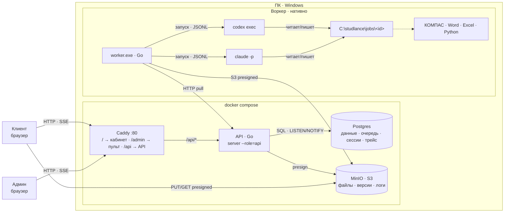
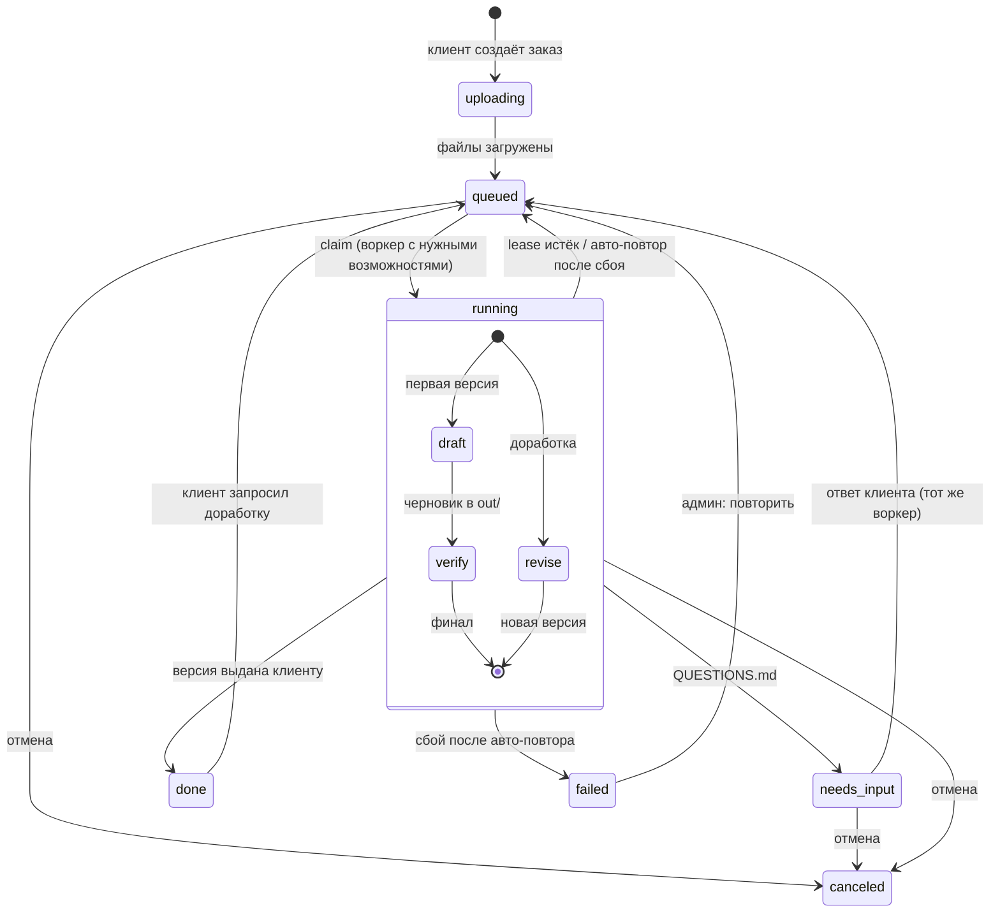
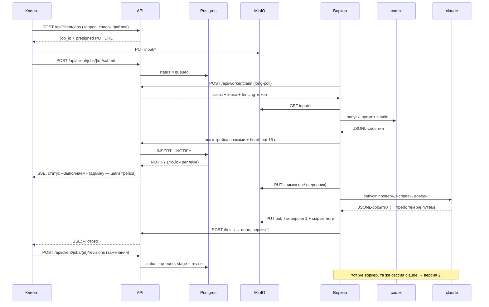

# Studlance — архитектура

Статус: **согласовано для MVP**. Документ фиксирует решения до начала разработки.
Всё, что здесь описано для MVP, — урезанная версия той же схемы, что пойдёт в прод: переход в прод меняет конфигурацию и развёртывание, а не код.

## 0. Что делаем

Автономный сервис выполнения студенческих работ.

**Клиент** в личном кабинете загружает всё, что у него есть (задание, методичку, варианты, примеры), и пишет текстом запрос. Дальше без участия людей:

1. **codex** делает **черновой** полный комплект работы (отчёт Word, расчёты Excel, чертежи КОМПАС, графики, схемы — что требует задание).
2. **claude** верифицирует всё и **сам исправляет** найденное, доводя работу до финала: ничего не выдумано, всё соответствует заданию и методичке, графики/чертежи/схемы корректны, оформление по требованиям.
3. Готовая работа **сразу** появляется у клиента в кабинете.
4. Если клиенту что-то не нравится, он запрашивает **доработку** с комментарием — claude дорабатывает, появляется новая версия.

Клиент видит только **свою работу и простые статусы**. Агенты, трейс, воркеры — внутренняя кухня.

**Админ** (оператор) в отдельном пульте видит всё: заказы всех клиентов, трейс каждого действия агентов, воркеры, метрики — и может вмешаться, но система не ждёт его одобрения.

Агентов **не ограничиваем**: как работать, какие инструменты использовать, где смотреть ГОСТы — решают они сами. Мы фиксируем только вход, выход и критерии проверки.

## 1. Принятые решения

| # | Решение |
|---|---|
| D1 | Две плоскости: **control plane** (сайт, API, Postgres, S3) и **execution plane** (воркеры с codex/claude). |
| D2 | Воркер **сам забирает** работу (pull по HTTPS, только исходящие соединения). Работает за NAT, входящие порты не нужны. |
| D3 | Единица работы — **заказ целиком**, закреплённый за одним воркером (сессии CLI и рабочая папка живут локально). |
| D4 | Процесс: **codex (черновик, один проход) → claude (проверка + правки до финала)**. Возврата к codex нет. |
| D5 | **Автономно.** Результат уходит клиенту сразу после claude, без одобрения админа. Единственная пауза — вопрос агента клиенту (`QUESTIONS.md`). |
| D6 | **Доработки:** клиент пишет замечания → claude правит в той же сессии → новая **версия** результата. Число доработок не ограничено. |
| D7 | Очередь — **таблица в Postgres** + `FOR UPDATE SKIP LOCKED`, leases, heartbeat, **fencing-токен**. Отдельного брокера нет. |
| D8 | Файлы — **S3 API** с первого дня (MinIO локально), передача по presigned URL мимо API. |
| D9 | Live-обновления — **SSE** + Postgres `LISTEN/NOTIFY`. Redis нет. |
| D10 | API **stateless**, без синглтонов. Модульный монолит: **один Go-бинарник с ролями** (`api`, позже `autoscaler`). Микросервисов нет. |
| D11 | Контракт API — **OpenAPI-first** (`api/openapi.yaml`): из него генерируются Go-сервер и TS-клиент. |
| D12 | API разделён на пространства **`/api/client`**, **`/api/admin`**, **`/api/worker`** с разными правами. |
| D13 | Авторизация: **email + пароль, серверные сессии** в Postgres (httpOnly-cookie), роли `client` и `admin`. Регистрации в MVP нет — пользователей создаёт CLI. |
| D14 | Два фронта: **клиентский кабинет** и **пульт админа** — отдельные приложения с общим пакетом UI и API-клиента. |
| D15 | Маршрутизация по **возможностям** воркера (`kompas`, `word`, `excel`, …) и требованиям заказа. |
| D16 | Трейс — свои таблицы (`agent_runs`, `trace_steps`) + **сырые JSONL-логи** агентов в S3. Видит только админ. |
| D17 | `user_id` во всех пользовательских данных, фильтр по нему встроен в каждый клиентский запрос. |
| D18 | MVP: сервер (docker compose) и воркер **на ПК**, агенты по подпискам. Прод: пул Windows-VM, агенты по API-ключам. |
| D19 | Стек: **Go** (API + воркер), **React + Vite + TypeScript** (фронты), PostgreSQL, MinIO/S3, Caddy. |
| D20 | **Превью листов в MVP:** у каждого документа комплекта есть PDF, воркер нарезает его на картинки страниц. Клиент видит работу прямо на сайте, админ сравнивает черновик и финал по листам. |
| D21 | **Замечания к доработке привязаны к месту:** файл, страница, точка на листе и текст. Claude получает их вместе с вырезками страниц. |

## 2. Топология MVP



Воркер ходит в API по HTTP так же, как будет ходить с удалённой VM. Перенос сервера на VPS — смена `server_url` в конфиге воркера. В проде кабинет и пульт разъезжаются по поддоменам (`studlance.ru`, `admin.studlance.ru`), пульт можно закрыть VPN или IP-allowlist.

## 3. Жизненный цикл заказа



- `status`: `uploading | queued | running | needs_input | done | failed | canceled`.
- `stage` (внутри `running`): `draft` (codex) → `verify` (claude) для первой версии; `revise` (claude) для доработок.
- **Версии результата:** v1 — после первого `verify`, каждая доработка даёт v2, v3… Клиент видит последнюю, админ — все.
- **Сбой этапа** → один автоматический повтор; второй сбой → `failed`, админ получает сигнал. Клиент при этом видит «Задерживается».
- `needs_attention` — флаг для админа: claude оставил нерешённые замечания, был сбой или клиент запросил доработку. На клиента не влияет.

### Что видит клиент

| Внутреннее состояние | Статус в кабинете |
|---|---|
| `uploading`, `queued` (первая версия) | Заказ принят |
| `running · draft` | Выполняем |
| `running · verify` | Проверяем |
| `needs_input` | Нужно уточнение (вопрос + поле ответа) |
| `queued`, `running · revise` | Дорабатываем |
| `done` | Готово (версия N) |
| `failed` | Задерживается — мы уже разбираемся |
| `canceled` | Отменён |

## 4. Контракт с агентами

### Рабочая папка

```
C:\studlance\jobs\<job_id>\
├─ input\             файлы клиента (как загружены, с относительными путями)
│  └─ revision-2\     файлы, приложенные к доработке (если были)
├─ TASK.md            запрос клиента + перечень прикреплённых файлов
├─ REVISION-2.md      замечания клиента к версии 1 (по одному файлу на доработку)
├─ out\               готовый комплект: .docx .xlsx .cdw/.frw .pdf .png …
├─ manifest.json      состав комплекта: какие документы, как называются, где их PDF
├─ preview\           PDF каждого документа из out/ — для превью, клиенту не выдаётся отдельно
├─ SUMMARY.md         codex: короткое название работы (первая строка) и что сделано
├─ QUESTIONS.md       (если появился) вопрос клиенту → пауза заказа
├─ VERIFICATION.md    claude: что проверил, что нашёл, что исправил
├─ verification.json  claude: машиночитаемый итог для админки
└─ .studlance\        служебное воркера (не трогать агентам)
```

`manifest.json` (пишет codex после черновика, claude обновляет):

```json
{
  "title": "Курсовая: расчёт и чертёж вала",
  "documents": [
    { "file": "out/Пояснительная записка.docx", "title": "Пояснительная записка", "kind": "Word", "preview": "preview/Пояснительная записка.pdf" },
    { "file": "out/Расчёт вала.xlsx",           "title": "Расчёт вала",           "kind": "Excel", "preview": "preview/Расчёт вала.pdf" },
    { "file": "out/Чертёж вала.cdw",            "title": "Чертёж вала",           "kind": "КОМПАС-3D", "preview": "preview/Чертёж вала.pdf" }
  ]
}
```

Состав комплекта известен уже после черновика: пока claude проверяет, клиент видит заготовки листов с названиями документов.

`verification.json`:

```json
{
  "found": 7,
  "fixed": 7,
  "remaining": [
    { "severity": "major|minor", "description": "…" }
  ]
}
```

### Что говорим агентам (суть промптов)

**codex, этап `draft`:**
> Прикреплены файлы: <список>. Задача: <запрос клиента>. Сначала проверь, хватает ли данных для выполнения. Если нет — напиши в `QUESTIONS.md` вопрос **клиенту простым языком** и остановись. Если хватает — сделай полный комплект работы в `out/`, опиши состав в `manifest.json`, положи PDF каждого документа в `preview/`, в `SUMMARY.md` первой строкой дай короткое название работы, дальше — что сделано.

**claude, этап `verify`:**
> В `input/` — задание и методические требования, в `out/` — черновик работы. Проверь всё: ничего не выдумано (данные, расчёты, источники), всё соответствует заданию и методичке, графики, чертежи и схемы корректны, оформление по требованиям. Исправь всё, что считаешь нужным, и доведи работу до финала. Обнови PDF в `preview/` и `manifest.json` под финальный комплект. Опиши проверку в `VERIFICATION.md` и итог в `verification.json`. Если без клиента не обойтись — вопрос ему простым языком в `QUESTIONS.md` и остановись.

**claude, этап `revise`:**
> Клиент посмотрел версию N и просит доработать: `REVISION-<N+1>.md` — замечания с привязкой к месту (документ, страница, где на листе) и вырезки этих мест в `input/revision-<N+1>/remarks/`; плюс файлы клиента, если он их приложил. Внеси правки в `out/`, проверь, что ничего не сломалось и работа по-прежнему соответствует требованиям. Обнови `VERIFICATION.md` и `verification.json`.

Промпты — шаблоны в `prompts/`, версия шаблонов записывается в заказ.

### Запуск CLI

Промпт всегда передаётся через **stdin** (без проблем с экранированием в Windows). Флаги проверены на `codex-cli 0.160.0` и `Claude Code 2.1.x`.

| | Новая сессия | Продолжение (ответ, доработка, перезапуск) |
|---|---|---|
| codex | `codex exec --json --skip-git-repo-check --dangerously-bypass-approvals-and-sandbox -C <ws> -` | `codex exec resume --json --skip-git-repo-check --dangerously-bypass-approvals-and-sandbox <thread_id> -` (cwd = ws) |
| claude | `claude -p --output-format stream-json --verbose --dangerously-skip-permissions --session-id <uuid>` (cwd = ws) | `claude -p --output-format stream-json --verbose --dangerously-skip-permissions --resume <uuid>` |

`thread_id` codex берётся из события `thread.started`; `uuid` сессии claude генерирует воркер. Оба сохраняются в БД сразу, как известны. Доработки идут в **той же сессии claude**, что делала проверку, — он помнит работу.

Агенты работают **без песочницы** — изоляция на уровне машины (раздел 12).

## 5. Последовательность одного заказа



## 6. Очередь, leases, отказоустойчивость

**Выдача заказа** (любой репликой API, без центрального планировщика):

```sql
UPDATE jobs SET
  status = 'running', worker_id = $worker, lease_epoch = lease_epoch + 1,
  lease_expires_at = now() + interval '60 seconds', updated_at = now()
WHERE id = (
  SELECT id FROM jobs
  WHERE (status = 'queued' OR (status = 'running' AND lease_expires_at < now()))
    AND (worker_id IS NULL OR worker_id = $worker)          -- закрепление за воркером
    AND requirements <@ (SELECT capabilities FROM workers WHERE id = $worker)
  ORDER BY created_at
  FOR UPDATE SKIP LOCKED
  LIMIT 1)
RETURNING *;
```

- **Lease** 60 с, **heartbeat** каждые 15 с. В ответе на heartbeat — флаг отмены.
- **Fencing:** `lease_epoch` растёт при каждой выдаче. Каждая запись воркера (трейс, файлы, состояние, finish) несёт epoch и принимается только если он совпадает с текущим. «Проснувшийся» старый воркер ничего не испортит.
- **Возврат просроченных** встроен в запрос выдачи — отдельный процесс-уборщик не нужен.
- **Перезапуск воркера:** заказ закреплён за ним, состояние (`stage`, id сессий) в БД, папка на диске → воркер забирает свой заказ и продолжает этап через `resume`.
- **Доработки** тоже идут на закреплённый воркер: там папка и сессия claude.
- **Смерть воркера в проде:** заказ открепляется и стартует на другом воркере с последнего снимка в S3; агент получает новую сессию с передачей контекста (что уже сделано, какие были доработки). Сессии CLI между машинами не переносим.
- **Таймаут этапа** (по умолчанию 3 ч, настраивается) считается сбоем.
- **Сбой этапа** → один автоматический повтор, затем `failed` и `needs_attention`.
- **Идемпотентность:** шаги трейса имеют `(agent_run_id, seq)` — повторная отправка пачки не создаёт дублей; файлы адресуются по `(job, version, stage, path)` + sha256.

## 7. Бэкенд (Go)

Модульный монолит, один бинарник:

| Модуль | Ответственность |
|---|---|
| `auth` | вход, выход, сессии, роли, middleware |
| `users` | клиенты и админы, создание через CLI |
| `jobs` | заказы, статусы, версии, доработки, ответы на вопросы, отмена, повтор |
| `queue` | claim, lease, heartbeat, fencing |
| `workers` | регистрация, токены, возможности, last_seen |
| `trace` | запуски агентов, шаги, события заказа |
| `live` | SSE-хаб: `LISTEN` в Postgres → подписанные браузеры (клиенту — только статусы) |
| `files` | presigned URL, снимки, версии, архив комплекта |

Роли бинарника: `server --role=api` (MVP и прод, N реплик), `server --role=autoscaler` (прод, пул VM). Служебные команды: `server migrate`, `server user create --email … --role admin|client`, `server worker token --name …`. Фоновые задачи, которым нужен единственный исполнитель (чистка по сроку хранения), берут Postgres advisory lock.

### API (черновой список, точный контракт — в `api/openapi.yaml`)

| Пространство | Эндпоинты | Права |
|---|---|---|
| `/api/auth` | `POST /login` · `POST /logout` · `GET /me` | все |
| `/api/client` | `POST /jobs` · `POST /jobs/{id}/submit` · `GET /jobs` · `GET /jobs/{id}` · `GET /jobs/{id}/stream` (SSE, только статусы) · `POST /jobs/{id}/answer` · `POST /jobs/{id}/revisions` (комментарий + замечания с местом на листе) · `POST /jobs/{id}/cancel` · `GET /jobs/{id}/files` · `GET /jobs/{id}/versions/{v}/pages` · `GET /jobs/{id}/bundle.zip` | роль `client`, **только свои заказы** |
| `/api/admin` | `GET /jobs` (все, фильтры) · `GET /jobs/{id}` · `GET /jobs/{id}/trace` · `GET /jobs/{id}/stream` (SSE, всё) · `GET /jobs/{id}/versions` · `POST /jobs/{id}/answer` · `POST /jobs/{id}/retry` · `POST /jobs/{id}/cancel` · `POST /jobs/{id}/notes` · `GET /clients` · `GET /clients/{id}` · `GET /workers` · `GET /metrics/summary` | роль `admin` |
| `/api/worker` | `POST /register` · `POST /claim` · `POST /jobs/{id}/heartbeat` · `…/trace` · `…/files` (presign) · `…/state` · `…/finish` | токен воркера, только закреплённые заказы |
| сервис | `GET /healthz` · `GET /metrics` | мониторинг |

## 8. Воркер (Go, Windows)

**Главный цикл:** `claim → подготовка папки → этап по stage → снимок out/ → … → finish`.
- первая версия: `codex (draft) → снимок черновика → claude (verify) → снимок версии 1`;
- доработка: `докачать файлы доработки, REVISION-N.md с вырезками мест → claude (revise, resume) → снимок версии N`.

**Превью листов** после каждого снимка: воркер рендерит PDF из `preview/` в PNG по страницам (poppler `pdftoppm` идёт вместе с воркером) и мини-копии для галереи, загружает в S3. Для финала дополнительно сравнивает страницы с черновиком попиксельно и сохраняет рамки изменённых областей — по ним пульт подсвечивает правки claude.

**Фоновые горутины:**
- **разбор JSONL** → шаги трейса (сообщение · команда · файл · веб-поиск · прочее) → пачки в API раз в секунду; сырой лог пишется на диск целиком и в конце этапа уходит в S3;
- **heartbeat** каждые 15 с → продлевает lease; при отмене или таймауте убивает **Windows Job Object** с агентом и всем деревом его процессов, затем закрывает КОМПАС и Office (их запускает COM, в дерево агента они не входят).

**Возможности** определяются при старте: `codex`, `claude` (в PATH), `kompas`, `word`, `excel` (ProgID в реестре), `libreoffice`, `python`, `browser` (Playwright + Chromium), `ltspice` и т. п.; плюс ручные `extra`/`disable` в конфиге.

**Окружение для «настоящей» работы.** Агенты не просто пишут текст, а запускают программы и вставляют результаты в отчёт: поднимают написанное приложение и снимают экраны через браузер (Playwright), снимают окна десктопных программ и 3D-моделей, строят графики из расчётов (Python: pandas, matplotlib, scipy), скачивают открытые данные (например, бухотчётность из ГИР БО). Всё это должно быть заранее установлено на воркере; набор инструментов — часть образа воркера и его списка возможностей.

**Требования заказа** клиент не указывает. В MVP у воркера все возможности, требования пустые. В проде требования определяет быстрый этап разбора (по типам файлов и тексту запроса) до выдачи на воркер.

**Конфиг** (`worker.toml`): `server_url`, `token`, `name`, `work_dir`, команды codex/claude и доп. аргументы (модель и т. п.), таймауты этапов.

**Режим работы:** консоль в MVP, Windows-служба в проде. Один заказ за раз на воркер (КОМПАС и Office плохо работают параллельно в одной пользовательской сессии).

## 9. Трейс и мониторинг (только админ)

- **Трейс заказа:** заказ → запуск агента (`agent_runs`) → шаги (`trace_steps`). У шага: время, агент, тип, краткое описание, payload (команда и её вывод, путь файла, текст сообщения).
- **Сырые логи** обоих агентов целиком в S3 — трейс можно перестроить, если изменится парсер.
- **Снимки `out/`:** черновик codex и каждая версия — видно, что именно поправила проверка и каждая доработка.
- **События заказа:** смены статуса, вопросы и ответы, доработки, итог проверки, сбои.
- **Метрики** (`/metrics`, Prometheus-формат): длина очереди по возможностям, воркеры онлайн, длительность этапов, токены и стоимость по агентам, найдено/исправлено claude, доля заказов с доработками, сбои.
- **Логи сервисов:** `log/slog` в JSON, трассировка запросов через OpenTelemetry. MVP — stdout; прод — Prometheus + Loki + Grafana.

## 10. Данные (Postgres)

| Таблица | Ключевые поля |
|---|---|
| `users` | `id, email, password_hash, role (client/admin), name, created_at, disabled_at` |
| `sessions` | `id_hash, user_id, created_at, expires_at, last_seen_at, user_agent, ip` |
| `jobs` | `id, user_id, title, prompt, requirements[], status, stage, current_version, needs_attention, worker_id, lease_epoch, lease_expires_at, cancel_requested, attempt, state jsonb, error, created_at, updated_at, finished_at` |
| `revisions` | `id, job_id, version (какую создаёт), comment, created_at, completed_at` |
| `revision_remarks` | `id, revision_id, document, page, x, y (доли 0–1 от размеров листа), text` |
| `pages` | `file_id, page, image_key, thumb_key, width, height, changed_boxes jsonb` — превью страниц и рамки изменений |
| `job_notes` | `id, job_id, author_id, text, created_at` — заметки админа |
| `workers` | `id, name, token_hash, capabilities[], info jsonb, last_seen_at` |
| `agent_runs` | `id, job_id, version, agent (codex/claude), stage, session_id, started_at, finished_at, exit_code, input_tokens, output_tokens, cost, raw_log_key` |
| `trace_steps` | `agent_run_id, seq, ts, type, summary, payload jsonb` — PK `(agent_run_id, seq)` |
| `events` | `id, job_id, ts, kind (status/question/answer/revision/verification/error), visible_to_client, data jsonb` |
| `files` | `id, job_id, kind (input/draft/version/log), version, path, storage_key, size, sha256, created_at` |

`state jsonb` у заказа: `codex_thread_id`, `claude_session_id`, `pending_answer`, версия промптов.
Название заказа — первые слова запроса, после черновика заменяется названием из `SUMMARY.md`.
Миграции — `goose`, встроены в бинарник, применяются при старте под advisory lock.
Прод: `trace_steps` и `events` партиционируются по времени.

## 11. Хранилище (S3)

```
jobs/<job_id>/input/<path>
jobs/<job_id>/input/revision-<n>/<path>
jobs/<job_id>/draft/<path>
jobs/<job_id>/v<n>/<path>
jobs/<job_id>/v<n>/pages/<document>/<page>.png   (+ мини-копии)
jobs/<job_id>/logs/<agent_run_id>.jsonl
```

Браузер и воркер получают presigned URL от API и работают с S3 напрямую. Клиенту выдаются URL только на `input/` и `v<n>/` своих заказов.

## 12. Безопасность

- **Агенты работают с полным доступом к машине.** В MVP воркер запускается **под отдельной учётной записью Windows** без личных файлов; в проде — отдельная VM, откат к чистому снапшоту между заказами.
- Загруженные клиентом файлы — недоверенный ввод (возможны prompt injection). На машине воркера нет секретов, кроме токена воркера.
- **Пользователи:** пароль хешируется Argon2id; сессия — случайный токен в httpOnly + Secure + SameSite=Lax cookie, в БД хранится только его хэш; выход и блокировка отзывают сессию сразу. Мутирующие запросы проверяют `Origin`. Ограничение частоты попыток входа.
- **Изоляция клиентов:** все запросы `/api/client` строятся с условием `user_id = <из сессии>` в самом SQL; доступ к чужому заказу неотличим от несуществующего (404).
- **Токен воркера** — персональный, хранится в БД как хэш, даёт доступ только к закреплённым за ним заказам.
- В проде пульт админа — на отдельном поддомене, дополнительно закрывается VPN или IP-allowlist.

## 13. Фронт

Два приложения в монорепо, общий стек: React + Vite + TypeScript, TanStack Query, Tailwind + shadcn/ui, TS-клиент из `openapi.yaml`. Отдаются Caddy как статика.

```
web/shared   UI-компоненты, тема, API-клиент, авторизация
web/client   кабинет клиента
web/admin    пульт админа
```

### Кабинет клиента (простой, дружелюбный)

| Экран | Содержимое |
|---|---|
| `/login` | вход |
| `/` | мои заказы: название, статус, дата, кнопка «Новый заказ» |
| `/new` | одно поле для запроса + зона загрузки файлов и папок; ниже пример готового комплекта на «столе» с вкладками «Технические / Гуманитарные / Программирование» |
| `/orders/:id` | **комплект на столе**: пока идёт работа — заготовки листов с названиями документов; когда готово — превью страниц, просмотр с листанием, переключатель версий, «Скачать всё»; **замечания прямо на листе** и «Отправить на доработку»; **сворачиваемое окошко статуса** с шагами и вопросом агента, если он есть |

Никаких упоминаний агентов, трейса и внутренних этапов — только понятные статусы из §3.

### Пульт админа (плотный, рабочий)

| Экран | Содержимое |
|---|---|
| `/admin/jobs` | все заказы: клиент, статус, этап, версия, время, флаг `needs_attention`, фильтры |
| `/admin/jobs/:id` | **разбор по листам**: слева live-трейс по этапам, в центре превью листов с переключателем «черновик / финал» и подсветкой изменённых мест, справа ведомость замечаний claude со ссылками на листы; действия (ответить за клиента, повторить, отменить), доработки клиента, заметки |
| `/admin/clients` | клиенты и история их заказов (мини-CRM) |
| `/admin/workers` | воркеры: онлайн, возможности, текущий заказ |
| `/admin/metrics` | очередь, длительность этапов, токены и стоимость, доработки, сбои |

Полноценную CRM (воронка, оплаты, переписка) не строим; при необходимости — интеграция с amoCRM/Bitrix24 через вебхуки.

## 14. Стек

| Слой | Выбор |
|---|---|
| API | Go, `net/http` + `oapi-codegen`, `pgx v5` + `sqlc`, `goose`, `minio-go`, `log/slog`, OpenTelemetry, Argon2id (`x/crypto`) |
| Воркер | Go, Windows Job Objects, `x/sys/windows/svc` (служба в проде) |
| Фронты | React, Vite, TypeScript, TanStack Query, Tailwind, shadcn/ui |
| Данные | PostgreSQL 16, MinIO (S3 API) |
| Вход | Caddy (MVP), балансировщик + CDN (прод) |
| Тесты | `go test` + testcontainers (Postgres, MinIO), фейковые codex/claude для e2e |
| Качество | `golangci-lint`, Biome |
| Развёртывание | docker compose (MVP) |

## 15. Горизонтальное масштабирование и путь в прод

Узкое место — воркеры (Windows-VM, лицензии КОМПАС, лимиты LLM), а не сервер: даже 1000 заказов в день при 1–2 ч на заказ — это ~100 одновременно работающих воркеров и единицы запросов в секунду к API.

| Часть | MVP | Прод |
|---|---|---|
| Вход | Caddy, разделение по пути | балансировщик, кабинет и пульт на разных поддоменах, CDN для статики |
| API | 1 экземпляр | N реплик того же образа |
| Postgres | контейнер | managed + PgBouncer, партиции трейса, реплики на чтение при необходимости |
| Файлы | MinIO | любое S3 |
| Воркеры | worker.exe на ПК | пул Windows-VM из золотого образа, тёплый резерв, `--role=autoscaler` по длине очереди для каждого набора возможностей |
| Агенты | подписки | API-ключи, пул ключей с учётом rate limit |
| Пользователи | созданы через CLI | регистрация, подтверждение email, вход через Telegram/Яндекс/VK |
| Наблюдаемость | трейс в пульте + stdout | + Prometheus, Loki, Grafana |

Что делает это возможным уже в MVP: stateless API (сессии в БД), всё состояние в Postgres/S3, выдача работы через блокировки в БД, нет синглтонов, идемпотентность и fencing, файлы мимо API, SSE через `NOTIFY`.

## 16. Отложено

- Юрисдикция и хранение персональных данных (152-ФЗ), трансграничная передача в LLM-провайдеров.
- Регистрация, восстановление пароля, вход через соцсети; биллинг и оплата.
- Уведомления (email, Telegram) о готовности и вопросах.
- Autoscaler и золотой образ Windows-VM, лицензирование КОМПАС для коммерческого использования.
- Этап разбора заказа для определения требований к воркеру.
- Переход агентов на API-ключи.
- Temporal или другой workflow-движок — только если процесс станет ветвистым.

## 17. Структура репозитория

```
api/openapi.yaml          единый контракт
cmd/server/               бинарник сервера (роли и служебные команды)
cmd/worker/               бинарник воркера
internal/                 модули: auth, users, jobs, queue, workers, trace, live, files, store, agents
prompts/                  шаблоны промптов codex и claude
web/shared/               общий UI и API-клиент
web/client/               кабинет клиента
web/admin/                пульт админа
deploy/                   docker-compose, Caddyfile
docs/                     ARCHITECTURE.md, PLAN.md
```
